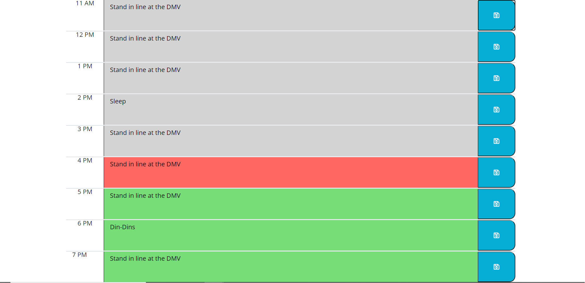

# 05 Third-Party APIs: Work Day Scheduler

  This is a simple daily scheduler that works by:

  -When the webpage opens it checks for any past saved events and renders them.
  -Today's date is set near the top of the page.
  -The hour is checked and the past hours in the table are rendered grey, the present hour is red, and future hours are green.
  -Click the middle textbox to enter your reminder for that hour, then click the save icon to save the reminder.
  -If you refesh the page, your save reminders are still there.
